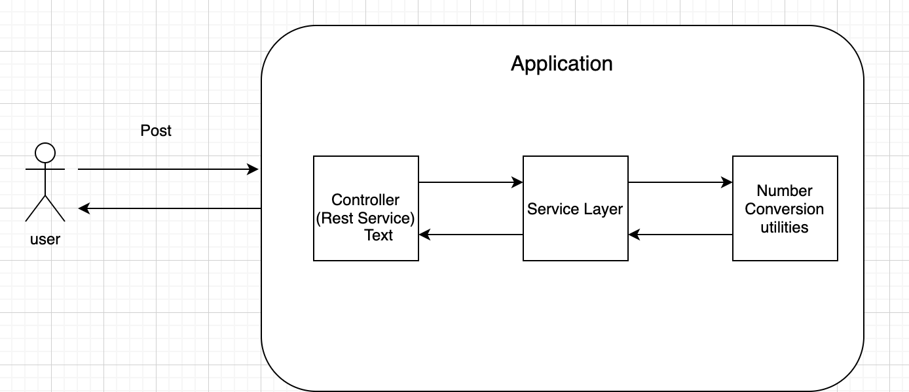
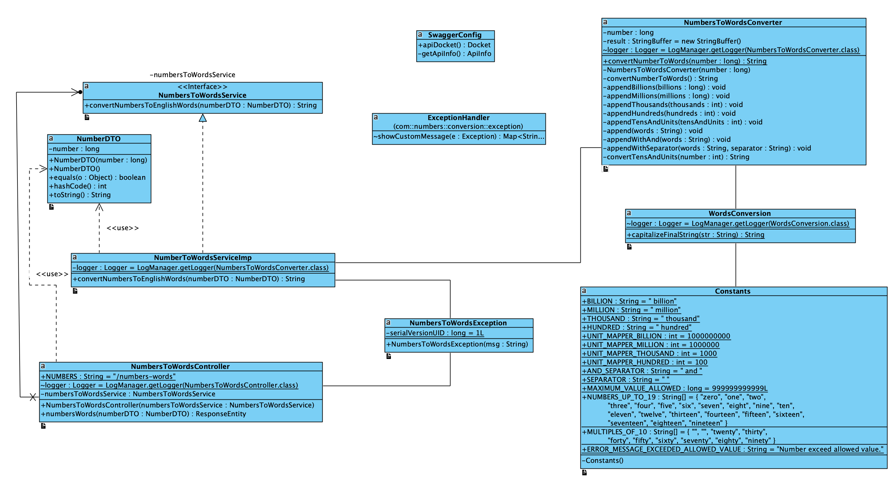
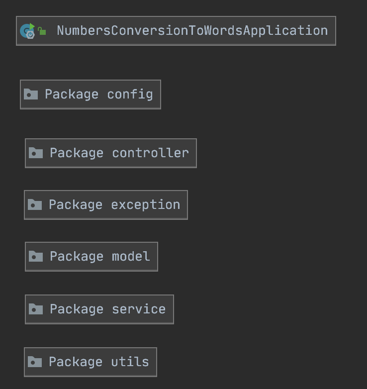
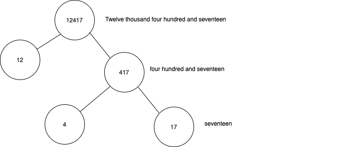
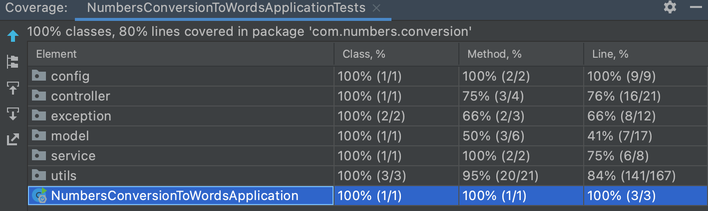
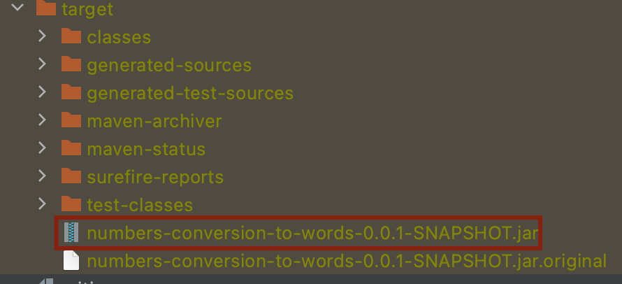
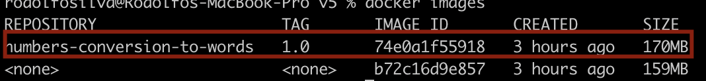

# conversion-numbers-to-words

This application converts a input number to its equivalent in English words. 

## High-level project architecture:


## Tech Stack

-Java version 8

-Spring boot, mvc.

-Junit v5

-Loombook

-spring-boot-starter-web

-maven

-Docker

-Swagger

-In this application, we do not need any database connectivity.

I pushed always to the main branch because I was the only developer working in this Project, in another scenario with multiple developers, we have to follow a branch strategy, with the different branches for development and master ones, with different conventions such as ```/feature, /fix, /hotfix``` etc.

The maximun and minimum allowed values are ```-9223372036854775808``` and ```9223372036854775808```, equivalent to the maximun and minimum Long Java values allowed.

To handle the input bad format error this app is using a ```@ControllerAdvice``` annotation in the ```ExceptionHandler``` class. This annotation allow us to get and handle all the exceptions in the app, in this case is important to handle the ```400 badRequest``` which is sent when the number is higher than the allowed one or we receive a character as input.

I also added a custom ```NumbersToWordsException``` which extends from ```Exception``` to handle the application exceptions. It is not used because of the nature of the application, the only exception I handling is the ```bad request one``` for bad inputs according to the expressed above.

##  Classes Diagram



##  Packages Diagram



##  How the algorithm Works

1) The program starts in the convertNumberToWords method. First divide the initial number by mapper units (billions,  millions, thousands, hundreds) and en each division calculate the remainder of the current number to get the next number in the sequence, for example with 12417, Calculate the remainder number. 12417 % 1000 = 417 with have 1 in the thousands variable and 10 as remainder this ten will be the next input in the sequence to be converted.

2) If the number has billions then the number global variable will be initialized with the billions number and the program will go again to the convertNumberToWords method to get the word equivalent number just for the billion part, otherwise if there is not billion part the program continues witn the next number in the sequence in this case million and so far and so for.

3) Find the next highest unit for 417, we will get Hundred.

4) Divide 417 by Hundred (417/100 = 4), the result is 4. 4 is found on NUMBERS_UP_TO_19 array. So, return “four”, in this case.

5) Again, calculate the remainder number. 417 % 100 = 17

6) 17 is mapped to ```Seventeen```, in the convertTensAndUnits method which separates tens and units and maps the number according to the implicit logic in this method. After hundred or thousand when they're alone and after hundred when they're together, is gonna be append and and word to the words.

Finally, the function capitalizeWords formmats the final input and  will return “Twelve thousand four hundred and seventeen”.




##  Code coverage results:

I covered different business cases in the ```NumbersToWordsConverterTest``` class according to the constraints of the application The final code coverge percentage for all the application is the next:




# Run the API Locally

To run it locally you must follow these three steps:

Clone the app and in the terminal go to the root directory with the command: ```cd conversion-numbers-to-words```.

In the terminal, located in the root directory (conversion-numbers-to-words) run ```mvn clean install```

Make sure that the .jar file was generated in the target directory:




In the same directory, run the command ```docker build -t numbers-conversion-to-words:1.0 .``` to create the APP image.

Make sure that the image was created with the ```docker images``` command: 



Then in the same terminal run the command:  ```docker run -p 8080:8080 numbers-conversion-to-words:1.0``` to run the app in local in the 8080 port.

## Swagger url in local:

http://localhost:8080/swagger-ui.html#/numbers-to-words-controller

## Postman Collection 

[](https://app.getpostman.com/run-collection/b38bcdcf721e2ba6fbb0)
