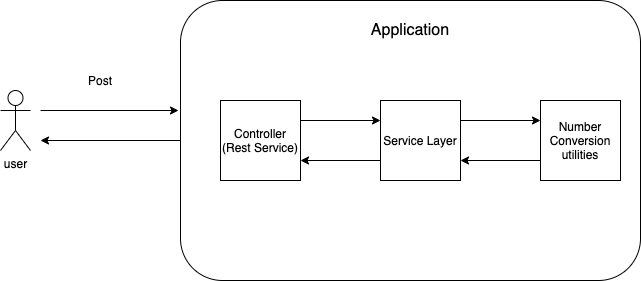

# conversion-numbers-to-words

This application converts a input number to its equivalent in English words.

## High-level project architecture:


## Tech Stack

-Java version 11

-Spring boot

-Junit v5

-Loombook

-spring-boot-starter-web

-maven

-Docker

-In this application, we do not need any database connectivity.

##  Classes Diagram

##  How the algorithem Works

a) First Find the highest unit by which we can divide our given number. For 11561, height unit is thousand (1000)
b) Divide the number with the selected unit, so we will get 11. 11 is already mapped, so return ‘Eleven’
c) Calculate the remainder number. 11516 % 1000 = 516
d) Find the next highest unit for 516, we will get Hundred.
e) Divide 516 by Hundred (516/100 = 5), the result is 5. 5 is found on our map. So, return “Five”.
f) Again, calculate the remainder number. 516 % 100 = 16
g) 16 already mapped to ‘Sixteen’, so return “Sixteen”.

Finally, the function will return “Eleven Thousand Five Hundred Sixty One”

The following image illustrates the above algorithm

##  Code coverage results:


# Run the API Locally


To run it locally you must follow these three steps:

In the terminal, located in the root directory (conversion-numbers-to-words) run ```mvn clean install```

Make sure that the .jar file was generated in the target directory:


In the same directory, run the command ```docker build -t numbers-conversion-to-words:1.0 .``` to create the APP image.

Make sure that the image was created with the ```docker images``` command: 


Then in the same terminal run the command:  ```docker run -p 8080:8080 numbers-conversion-to-words:1.0``` to run the app in local in the 8080 port.

Postman Collection 📢

[](https://app.getpostman.com/run-collection/34cd02999866616572f7)
