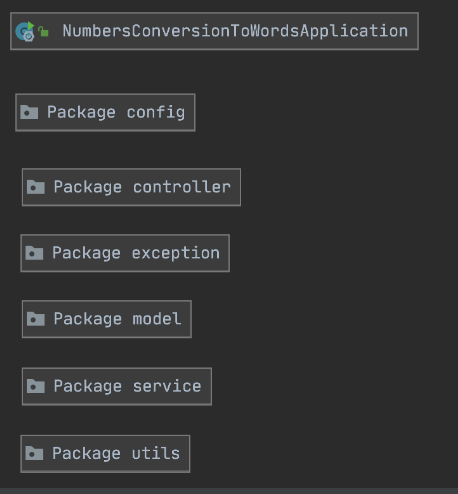

# conversion-numbers-to-words

This application converts a input number to its equivalent in English words. 

## High-level project architecture:


## Tech Stack

-Java version 8

-Spring boot, mvc.

-Junit v5

-Lombok

-spring-boot-starter-web

-maven

-Docker

-Swagger

-In this application, we do not need any database connectivity.

I pushed my changes always to the main branch because I was the only developer working in this Project, in another scenario with multiple developers, we have to follow a branch strategy, with the different branches for development and master ones, with different conventions such as ```/feature, /fix, /hotfix``` etc.

The maximum and minimum allowed values are ```-9223372036854775808``` and ```9223372036854775807```, equivalent to the maximum and minimum Long Java values allowed.

To handle the input bad format error this app is using a ```@ControllerAdvice``` annotation in the ```ExceptionHandler``` class. This annotation allow us to get and handle all the exceptions in the app, in this case is important to handle the ```400 badRequest``` which is sent when the number is higher than the allowed one or we receive a character as input.

I also added a custom ```NumbersToWordsException``` which extends from ```Exception``` to handle the application exceptions. It is not used because of the nature of the application, the only exception I handling is the ```bad request one``` for bad inputs according to the expressed above.

##  Classes Diagram


##  Packages Diagram



##  How the algorithm Works

1) As general explanation the number has different mapping units for division and as mapper words, trillions billions and so far and so for.

2) The program starts in the convertNumberToWords method. First divide the initial number by mapper units (billions,  millions, thousands, hundreds) and after each simple division calculate the remainder of the current number to get the next number in the sequence, for example with 12417, 
we calculate the remainder number ```12417 % 1000 = 417``` with have ```12``` in the thousands variable and ```417``` as remainder.
this ```417``` will be the next input in the sequence to be converted, after 12and will be divided by the hundred mapper and so far and so for.

3) 12 is the current program input to be mapped to words. In this case we just will have tens and units to convert.
12 will be mapped to twelve + thousand and continue with the next mapper.

4) 417 will be the Divide  by Hundred (417/100 = 4), the result is 4 Hundrer in its mapping.

5) Again, calculate the remainder number. 417 % 100 = 17, and 17 4 is found on NUMBERS_UP_TO_19 array. So, return ```Seventeen```, in this case the convertTensAndUnits method.
For this case we append an ```and``` separator. each time we have ten units.

7)Finally, the function capitalizeWords formats the final input and  will return “Twelve thousand four hundred and seventeen”.

In the case of negative numbers the program appends a negative word at the begin of the final translate number, using the isNegativeNumber flag variable.


##  Code coverage results:

I covered different business cases in the ```NumbersToWordsConverterTest``` class according to the constraints of the application The final code coverage percentage for all the application is the next:


# Run the API Locally

To run it locally you must follow these three steps:

Clone the app and in the terminal go to the root directory with the command: ```cd conversion-numbers-to-words```.

In the terminal, located in the root directory (conversion-numbers-to-words) run ```mvn clean install```

Make sure that the .jar file was generated in the target directory:


In the same directory, run the command ```docker build -t numbers-conversion-to-words:1.0 .``` to create the APP image.

Make sure that the image was created with the ```docker images``` command: 


Then in the same terminal run the command:  ```docker run -p 8080:8080 numbers-conversion-to-words:1.0``` to run the app in local in the 8080 port.

## Swagger url in local:

http://localhost:8080/swagger-ui.html#/numbers-to-words-controller

## Negative Long allowed number test:

I tested in postman the big negative number allowed by the Long type (-9223372036854775808).


## Postman Collection 


[](https://app.getpostman.com/run-collection/98b1a524bfd95a2aebce)
